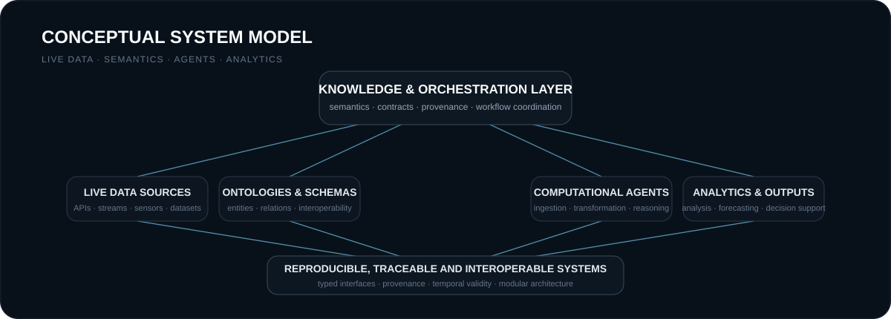

  

 

## Profile

I am a software developer focused on **ontology-driven, agent-based, and data-intensive systems** that connect live data, structured knowledge, and reproducible analytical workflows.

My work is particularly concerned with **knowledge representation, semantic interoperability, agent engineering, geospatial and temporal data processing, provenance-aware pipelines, and explainable software architecture**.

Rather than treating ingestion, analysis, and orchestration as isolated concerns, I am interested in systems in which these components interact through **explicit contracts, shared semantics, and traceable transformations**.

 

## Areas of Work

<table>
<tr>
<td width="33%" valign="top">

### Knowledge & Semantics

- Ontologies
- Knowledge graphs
- RDF / SPARQL
- Semantic data modelling
- Schema design
- Semantic interoperability

</td>
<td width="33%" valign="top">

### Data & Analytics

- Live data integration
- Geospatial computation
- Temporal data processing
- Time-series workflows
- Data provenance
- Analytical pipelines

</td>
<td width="33%" valign="top">

### Systems & Engineering

- Agent-based systems
- API design
- Typed contracts
- Test-driven development
- Reproducible software
- Modular architecture

</td>
</tr>
</table>

 

  

 

## Engineering Approach

I prefer systems designed around **clarity, traceability, and reproducibility**.

For data-intensive applications, I treat provenance, temporal validity, spatial context, source quality, uncertainty, and interoperability as part of the domain model rather than secondary implementation concerns.

My engineering approach therefore emphasises:

- **Authoritative real-world data** over fabricated production values.
- **Typed and stable interfaces** over ad-hoc integration.
- **Modular agent responsibilities** over monolithic application logic.
- **Reproducible analytical workflows** over one-off results.
- **Transparent modelling assumptions** over opaque outputs.
- **Test-driven and incremental development** over fragile rapid prototyping.
- **Explicit data-state semantics** separating observations, models, forecasts, derived values, and scenarios.
- **Graceful degradation** when external sources are incomplete, stale, or unavailable.

 

## Technical Direction

I am currently deepening my work in **ontology engineering, semantic knowledge representation, agent-oriented software architecture, live and streaming data integration, geospatial and spatiotemporal systems, and reproducible analytical workflows**.

A recurring theme in my work is the design of systems that combine **structured knowledge, live data, and computational agents** into coherent, inspectable, and adaptable software platforms.

 

## Applied Work

The following repositories represent applied work related to these broader engineering topics:

<table>
<tr>
<td width="50%" valign="top">

### [Berlin Urban Intelligence](https://github.com/nfloser/berlin-urban-intelligence)

Agent-oriented integration of heterogeneous urban data, semantic knowledge, and cross-domain analysis.

**Themes**  
Agents · knowledge representation · provenance · cross-domain integration

</td>
<td width="50%" valign="top">

### [Berlin Urban Live Twin](https://github.com/nfloser/berlin-urban-live-twin)

Integration of heterogeneous real-world urban data into a dynamic spatial and temporal representation.

**Themes**  
Live data · geospatial integration · temporal state · data modelling

</td>
</tr>
<tr>
<td width="50%" valign="top">

### [Berlin Urban Resilience Twin](https://github.com/nfloser/berlin-urban-resilience-twin)

Network-based analysis of accessibility, infrastructure disruption, and resilience scenarios.

**Themes**  
Graphs · routing · accessibility · scenario analysis

</td>
<td width="50%" valign="top">

### [Energy Forecasting Digital Twin](https://github.com/nfloser/energy-forecasting-digital-twin)

Reproducible short-term forecasting using real-world time-series data and transparent baseline evaluation.

**Themes**  
Time series · forecasting · validation · reproducibility

</td>
</tr>
</table>

 

## Collaboration

I am interested in technical exchange around **ontologies, knowledge graphs, agent-based systems, semantic technologies, live data platforms, geospatial systems, analytical software, and reproducible research engineering**.

---

  · leave a follow if interested ·

