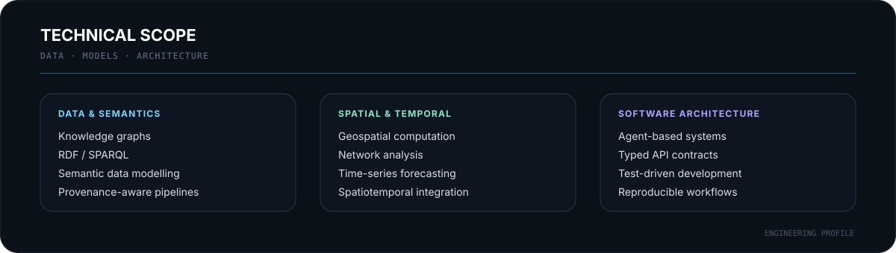

<p align="center">
  
</p>

<p align="center">
  <a href="https://github.com/nfloser/berlin-urban-intelligence"><b>Berlin Urban Intelligence</b></a>
  &nbsp;&nbsp;·&nbsp;&nbsp;
  <a href="https://github.com/nfloser/berlin-urban-live-twin">Urban Live Twin</a>
  &nbsp;&nbsp;·&nbsp;&nbsp;
  <a href="https://github.com/nfloser/berlin-urban-resilience-twin">Resilience Twin</a>
  &nbsp;&nbsp;·&nbsp;&nbsp;
  <a href="https://github.com/nfloser/energy-forecasting-digital-twin">Energy Forecasting</a>
</p>

<br>

## Engineering Profile

I am a software developer focused on **research-oriented, data-intensive systems** that connect real-world observations, computational models, geospatial information and explainable software architecture.

My current work centres on **urban digital twins, geospatial data engineering, time-series forecasting, network analysis, semantic interoperability and agent-based system design**. I am particularly interested in systems that integrate heterogeneous data while preserving provenance, temporal validity, spatial context, uncertainty and reproducibility.

<br>

## Current Focus — Berlin Urban Intelligence

<table>
<tr>
<td width="62%" valign="top">

### An agent-based urban intelligence platform for Berlin

**Berlin Urban Intelligence** is the long-term integration project connecting mobility, energy, environmental, climate, infrastructure and resilience information within a common digital-twin architecture.

The platform is designed around specialised computational agents, shared machine-readable contracts, semantic knowledge representation, provenance-aware processing, geospatial and temporal models, and reproducible analytical workflows.

A central design rule is that **observations, official model outputs, project-derived values, forecasts and hypothetical scenarios remain explicitly distinguishable throughout the processing chain**.

[Explore Berlin Urban Intelligence →](https://github.com/nfloser/berlin-urban-intelligence)

</td>
<td width="38%" valign="top">

### System principles

```text
REAL-WORLD DATA
       ↓
   VALIDATION
       ↓
   PROVENANCE
       ↓
  DOMAIN AGENTS
       ↓
 SHARED KNOWLEDGE
       ↓
CROSS-DOMAIN ANALYSIS
```

`reproducible` · `typed` · `geospatial`  
`provenance-aware` · `test-driven`

</td>
</tr>
</table>

<br>

<p align="center">
  
</p>

<br>

## Selected Systems

<table>
<tr>
<td width="50%" valign="top">

### Berlin Urban Live Twin
`RESEARCH PROTOTYPE`

A digital-twin project integrating real-world urban data into a dynamic representation of Berlin for cross-domain analysis of environmental, mobility and infrastructure conditions.

**Technical focus**  
Geospatial integration · temporal state · heterogeneous data ingestion · urban data modelling

[View repository →](https://github.com/nfloser/berlin-urban-live-twin)

</td>
<td width="50%" valign="top">

### Berlin Urban Resilience Twin
`RESEARCH PROTOTYPE`

A semantic resilience and routing digital twin for analysing accessibility, infrastructure disruption and network-level impact across urban systems.

**Technical focus**  
Graph analysis · routing · accessibility · infrastructure resilience · scenario modelling

[View repository →](https://github.com/nfloser/berlin-urban-resilience-twin)

</td>
</tr>
<tr>
<td width="50%" valign="top">

### Energy Forecasting Digital Twin
`RESEARCH PROTOTYPE`

A research-oriented digital twin for short-term energy demand forecasting using real-world time-series data, weather observations, reproducible evaluation and transparent baseline comparison.

**Technical focus**  
Time-series forecasting · temporal validation · model evaluation · reproducible ML workflows

[View repository →](https://github.com/nfloser/energy-forecasting-digital-twin)

</td>
<td width="50%" valign="top">

### Emerging Urban Domain Twins
`INTEGRATION TRACK`

Additional mobility, environmental-exposure and urban-heat components extend the wider Berlin Urban Intelligence architecture and are designed to converge into specialised domain agents.

**Technical focus**  
GTFS · traffic state · air quality · exposure analysis · urban climate · thermal burden

[Mobility](https://github.com/nfloser/berlin-urban-mobility-twin) · [Exposure](https://github.com/nfloser/berlin-environmental-exposure-twin) · [Urban Heat](https://github.com/nfloser/berlin-urban-heat-twin)

</td>
</tr>
</table>

<br>

<p align="center">
  
</p>

<br>

## Engineering Approach

For data-intensive and research-oriented software, I treat **provenance, data quality, temporal validity, spatial reference systems, uncertainty and source availability as part of the domain model**, rather than as secondary implementation details.

The systems I build therefore emphasise:

- **Test-driven and incremental development** with deterministic regression coverage.
- **Authoritative real-world data sources** instead of fabricated production data.
- **Explicit data-state semantics** separating observed, modelled, forecast, derived and scenario information.
- **Transparent model evaluation** with reproducible baselines and leakage-aware validation.
- **Typed interfaces and stable contracts** across domain boundaries.
- **Geospatial correctness** through explicit coordinate reference systems and validated geometry operations.
- **Traceable transformations and provenance** across ingestion, processing and analytical stages.
- **Graceful degradation** when external data sources are stale, incomplete or unavailable.

<br>

## Current Technical Direction

I am currently deepening my work in **semantic knowledge representation, RDF/SPARQL, geospatial computation, spatiotemporal modelling, time-series forecasting, distributed agent architectures and cross-domain digital-twin integration**.

A major focus is the transition from standalone analytical prototypes toward **interoperable computational agents** that can contribute to a shared urban intelligence system without sacrificing explainability, provenance or scientific reproducibility.

<br>

## Collaboration

I am interested in technical exchange and collaboration around **digital twins, geospatial systems, intelligent infrastructure, semantic technologies, forecasting systems, knowledge graphs and data-intensive research software**.

I am especially interested in projects where software engineering is tightly coupled to real-world data, analytical models and explicit system architecture.

<br>

---

<p align="center">
  <sub>SOFTWARE DEVELOPMENT · URBAN DIGITAL TWINS · GEOSPATIAL INTELLIGENCE · DATA-INTENSIVE SYSTEMS</sub>
</p>
