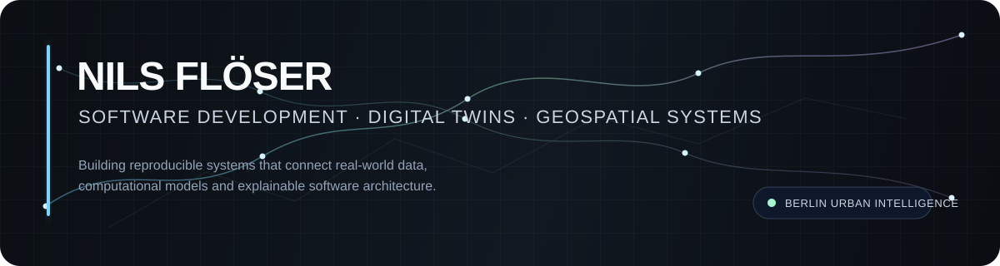
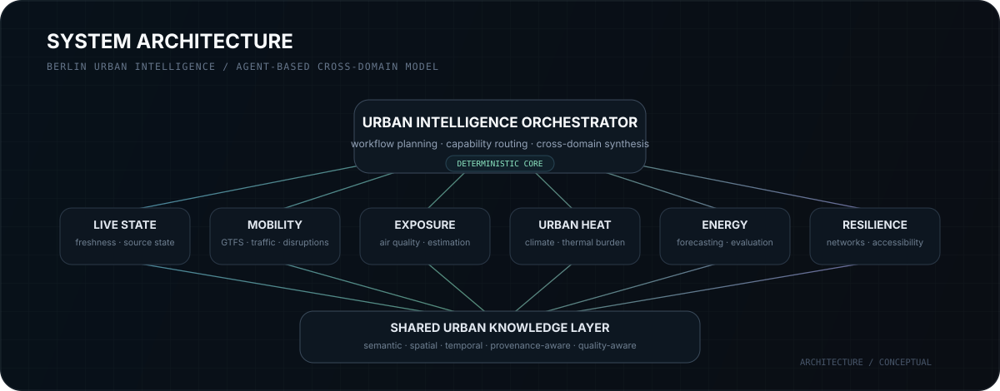

<p align="center">
  
</p>

<p align="center">
  <a href="https://github.com/nfloser/berlin-urban-intelligence"><b>Berlin Urban Intelligence</b></a>
  &nbsp;·&nbsp;
  <a href="https://github.com/nfloser/berlin-urban-live-twin">Urban Live Twin</a>
  &nbsp;·&nbsp;
  <a href="https://github.com/nfloser/berlin-urban-resilience-twin">Resilience Twin</a>
  &nbsp;·&nbsp;
  <a href="https://github.com/nfloser/energy-forecasting-digital-twin">Energy Forecasting</a>
</p>

<br>

## Profile

I am a software developer focused on **research-oriented, data-intensive systems** that connect real-world observations, computational models, geospatial information and explainable software architecture.

My current work centres on **urban digital twins, geospatial data engineering, forecasting, network analysis, semantic interoperability and agent-based system design**. I am particularly interested in systems that integrate heterogeneous data while preserving provenance, temporal validity, spatial context, uncertainty and reproducibility.

<br>

## Current Research & Engineering Focus

<table>
<tr>
<td width="58%" valign="top">

### Berlin Urban Intelligence

**Berlin Urban Intelligence** is an agent-based urban intelligence and digital-twin platform for Berlin.

The system is designed to integrate mobility, energy, environmental, climate, infrastructure and resilience information into a shared architecture for **cross-domain analysis and scenario assessment**.

Its long-term architecture combines specialised computational agents, shared data contracts, semantic knowledge representation, provenance-aware processing, geospatial and temporal models, and reproducible analytical workflows.

A central engineering principle is that **observations, official model outputs, project-derived values, forecasts and hypothetical scenarios remain explicitly distinguishable throughout the complete processing chain**.

[View the project →](https://github.com/nfloser/berlin-urban-intelligence)

</td>
<td width="42%" valign="top">

### Core principles

```text
REAL DATA
    ↓
VALIDATION
    ↓
PROVENANCE
    ↓
DOMAIN AGENTS
    ↓
SHARED KNOWLEDGE
    ↓
CROSS-DOMAIN ANALYSIS
```

**Engineering priorities**

- reproducibility
- explicit data contracts
- transparent uncertainty
- test-driven development
- semantic interoperability
- geospatial correctness
- graceful degradation
- evidence-based modelling

</td>
</tr>
</table>

<br>

<p align="center">
  
</p>

<br>

## Selected Systems

<table>
<tr>
<td width="50%" valign="top">

### Berlin Urban Live Twin
**Dynamic urban state integration**

A digital-twin prototype focused on integrating real-world urban data into a coherent representation of Berlin's changing environmental, mobility and infrastructure conditions.

**Focus:** geospatial integration · temporal state · external data ingestion

[Repository →](https://github.com/nfloser/berlin-urban-live-twin)

</td>
<td width="50%" valign="top">

### Berlin Urban Resilience Twin
**Network and infrastructure resilience**

A semantic resilience and routing twin for analysing accessibility, disruption scenarios and network-level effects across urban infrastructure.

**Focus:** graph analysis · routing · accessibility · disruption modelling

[Repository →](https://github.com/nfloser/berlin-urban-resilience-twin)

</td>
</tr>
<tr>
<td width="50%" valign="top">

### Energy Forecasting Digital Twin
**Reproducible predictive modelling**

A research-oriented digital twin for short-term energy demand forecasting using real time-series data, weather observations, reproducible evaluation and transparent baseline comparison.

**Focus:** forecasting · temporal validation · model evaluation · reproducibility

[Repository →](https://github.com/nfloser/energy-forecasting-digital-twin)

</td>
<td width="50%" valign="top">

### Emerging Domain Agents
**Mobility · Exposure · Urban Heat**

Additional domain components extend the wider Berlin Urban Intelligence architecture with public-transport and traffic state, environmental exposure analysis, and urban-climate / thermal-burden modelling.

**Focus:** GTFS · air quality · climate data · cross-domain integration

</td>
</tr>
</table>

<br>

## Technical Direction

<table>
<tr>
<td valign="top" width="33%">

### Data & Semantics

- Knowledge graphs
- RDF / SPARQL
- Semantic data modelling
- Provenance-aware pipelines
- Typed data contracts
- Source-quality modelling

</td>
<td valign="top" width="33%">

### Spatial & Temporal Systems

- Geospatial processing
- Coordinate reference systems
- Network analysis
- Time-series modelling
- Forecasting
- Spatiotemporal integration

</td>
<td valign="top" width="33%">

### Software Architecture

- Agent-based systems
- API design
- Test-driven development
- Modular services
- Reproducible workflows
- Containerised deployment

</td>
</tr>
</table>

<br>

## Engineering Philosophy

I prefer systems built around **explicit contracts, deterministic behaviour, traceable transformations and reproducible evaluation**.

For data-intensive and research-oriented software, provenance, data quality, temporal validity, spatial reference systems, uncertainty and source availability are not secondary implementation concerns; they are part of the domain model itself.

```text
truth over appearance
real data over synthetic demonstrations
explicit uncertainty over false precision
shared contracts over ad-hoc integration
provenance over unexplained values
tests over assumptions
reproducibility over one-off success
```

<br>

## Current Learning & Research

I am currently deepening my work in **semantic knowledge representation, RDF/SPARQL, geospatial computation, spatiotemporal modelling, time-series forecasting, distributed agent architectures and cross-domain digital-twin integration**.

A major focus is the transition from standalone analytical prototypes toward **interoperable computational agents** that can contribute to a larger urban intelligence system without sacrificing explainability, provenance or scientific reproducibility.

<br>

## Collaboration

I am interested in technical exchange and collaboration around **digital twins, geospatial systems, intelligent infrastructure, semantic technologies, forecasting systems, knowledge graphs and data-intensive research software**.

I am especially interested in projects where software engineering is tightly coupled to real-world data, analytical models and explicit system architecture.

<br>

---

<p align="center">
  <sub>
    Software Development · Urban Digital Twins · Geospatial Intelligence · Data-Intensive Systems
  </sub>
</p>
